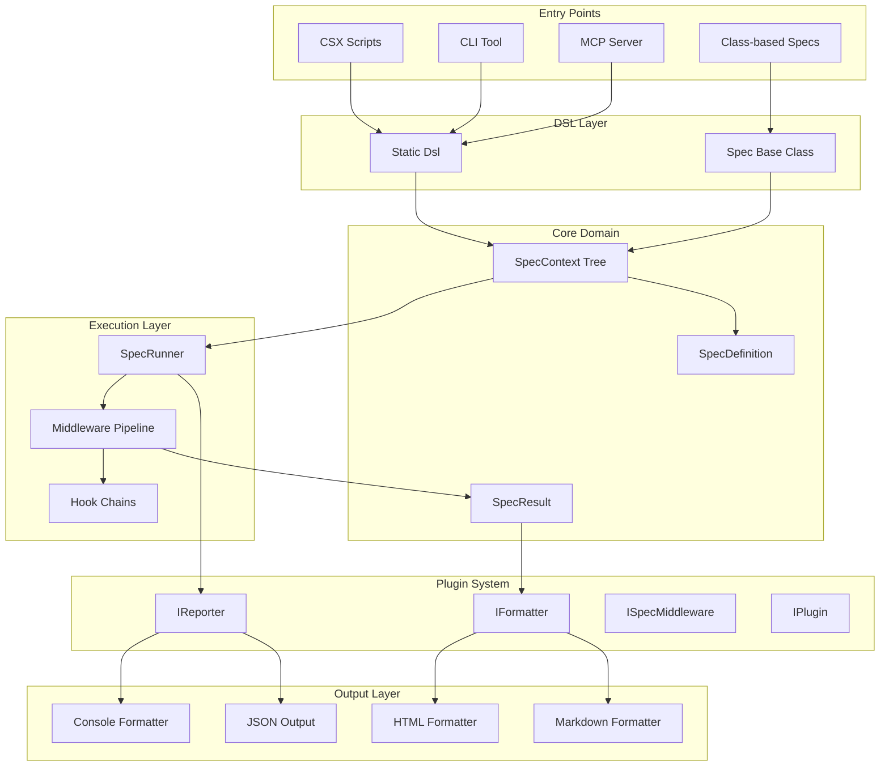
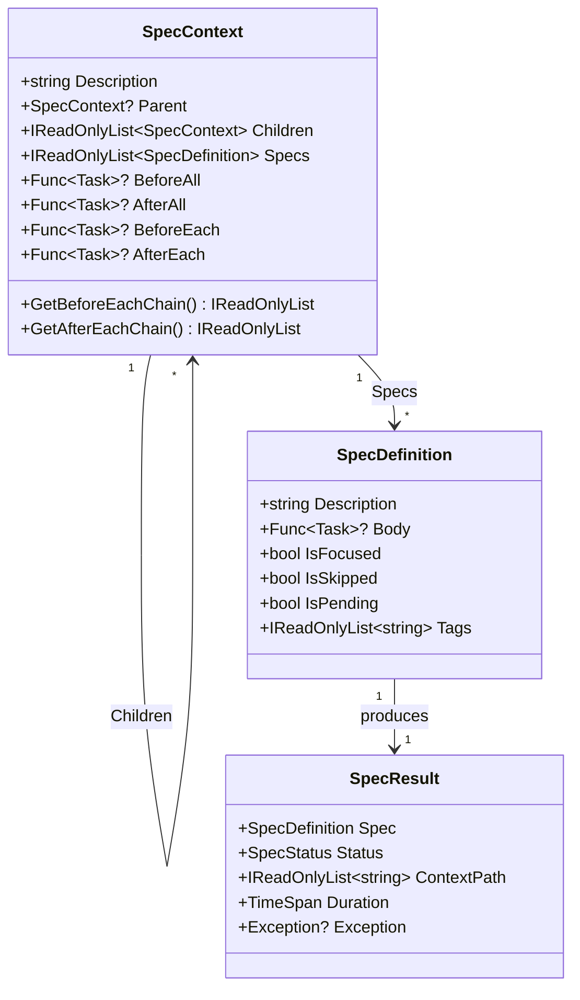
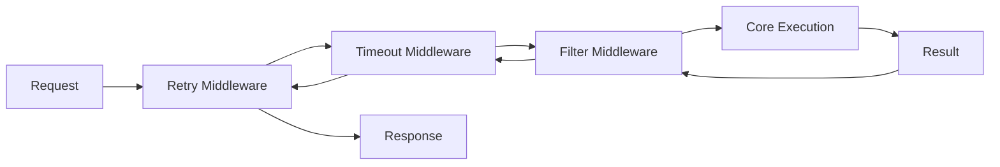
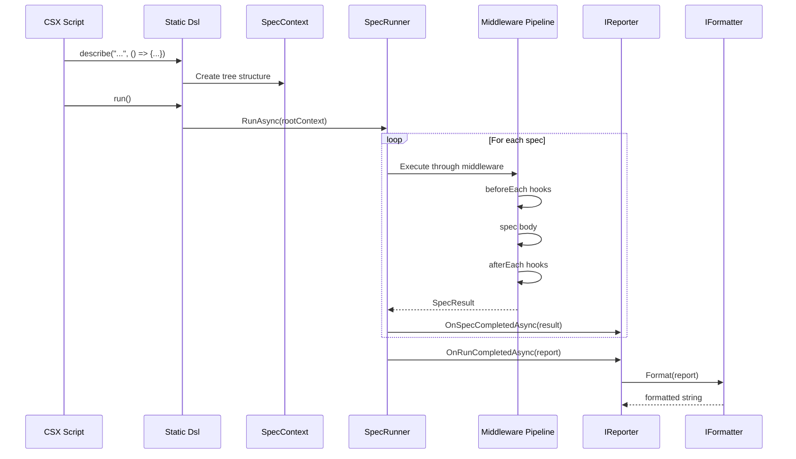

# DraftSpec Architecture

This document describes the architecture and design decisions behind DraftSpec, an RSpec-inspired testing framework for .NET.

## Overview

DraftSpec provides a behavior-driven development (BDD) testing experience for .NET, supporting both CSX scripts and class-based specs. The architecture prioritizes:

- **Simplicity**: Minimal boilerplate for writing specs
- **Extensibility**: Plugin-based architecture for formatters, reporters, and middleware
- **Performance**: Parallel execution and streaming output support
- **AI Integration**: MCP server for AI-assisted test development

## Layer Architecture



## Project Structure

```
src/
├── DraftSpec/                      # Core library
│   ├── Dsl.cs                      # Static DSL entry point (partial class)
│   ├── Dsl.Context.cs              # describe/context blocks
│   ├── Dsl.Specs.cs                # it/fit/xit specs
│   ├── Dsl.Hooks.cs                # before/after hooks
│   ├── Dsl.Expect.cs               # expect() assertions
│   ├── Dsl.Run.cs                  # run() execution
│   ├── Spec.cs                     # Class-based alternative
│   ├── SpecContext.cs              # Tree node for describe blocks
│   ├── SpecDefinition.cs           # Single spec definition
│   ├── SpecResult.cs               # Execution result
│   ├── SpecRunner.cs               # Tree walker + middleware executor
│   ├── SpecRunnerBuilder.cs        # Fluent configuration
│   ├── Expectations/               # Assertion implementations
│   ├── Middleware/                 # Built-in middleware
│   └── Plugins/                    # Plugin interfaces
├── DraftSpec.Cli/                  # Command-line tool
├── DraftSpec.Mcp/                  # MCP server for AI integration
├── DraftSpec.Formatters.Abstractions/  # IFormatter interface
├── DraftSpec.Formatters.Console/   # Console/terminal output
├── DraftSpec.Formatters.Html/      # HTML report generation
└── DraftSpec.Formatters.Markdown/  # Markdown report generation
```

## Core Domain Model

### SpecContext (Composite Pattern)

`SpecContext` forms a tree structure representing nested `describe` blocks:



### Hook Execution Order

Hooks execute in a specific order to ensure proper setup/teardown:

```
beforeAll (root)
  beforeAll (parent)
    beforeAll (child)
      beforeEach (root → parent → child)
        spec body
      afterEach (child → parent → root)
    afterAll (child)
  afterAll (parent)
afterAll (root)
```

Hook chains are cached for performance to avoid repeated tree traversal.

## Design Patterns

### 1. Middleware Pipeline (ASP.NET Core Style)

The `SpecRunner` uses a middleware pipeline for cross-cutting concerns:

```csharp
public interface ISpecMiddleware
{
    Task<SpecResult> ExecuteAsync(
        SpecExecutionContext context,
        Func<SpecExecutionContext, Task<SpecResult>> next);
}
```

Middleware can:
- Run code before/after spec execution
- Modify the result (e.g., retry on failure)
- Short-circuit execution (e.g., timeout, filtering)



Built-in middleware:
- `RetryMiddleware` - Retry failed specs
- `TimeoutMiddleware` - Cancel long-running specs
- `FilterMiddleware` - Skip specs by predicate, tags, or pattern

### 2. Builder Pattern (SpecRunnerBuilder)

Fluent API for configuring the runner:

```csharp
var runner = SpecRunner.Create()
    .WithRetry(maxRetries: 3)
    .WithTimeout(5000)
    .WithTagFilter("fast", "unit")
    .WithParallelExecution()
    .Build();
```

### 3. Strategy Pattern (IFormatter, IReporter)

**IFormatter** - Transforms a `SpecReport` into a string format:
```csharp
public interface IFormatter
{
    string Format(SpecReport report);
    string FileExtension { get; }
}
```

**IReporter** - Receives events during execution:
```csharp
public interface IReporter
{
    Task OnRunStartingAsync(RunStartingContext context);
    Task OnSpecCompletedAsync(SpecResult result);
    Task OnRunCompletedAsync(SpecReport report);
}
```

Formatters are stateless transforms; reporters perform side effects (file I/O, notifications).

### 4. Plugin Pattern

Base interface for extensibility:

```csharp
public interface IPlugin : IDisposable
{
    string Name { get; }
    string Version { get; }
    void Initialize(IPluginContext context);
}
```

Specialized interfaces extend this:
- `IFormatterPlugin` - Provides formatters
- `IReporterPlugin` - Provides reporters
- `IMiddlewarePlugin` - Provides middleware

## Thread-Safety Model

### AsyncLocal for Static DSL

The static `Dsl` class uses `AsyncLocal<T>` for thread-safe context isolation:

```csharp
public static partial class Dsl
{
    private static readonly AsyncLocal<SpecContext?> CurrentContextLocal = new();
    private static readonly AsyncLocal<SpecContext?> RootContextLocal = new();
}
```

This enables:
- Multiple concurrent spec executions in separate async contexts
- Safe use in parallel test scenarios
- No global state pollution between executions

### Parallel Execution

`SpecRunner` supports parallel spec execution within contexts:

```csharp
runner.WithParallelExecution(maxDegreeOfParallelism: 4)
```

Parallelism rules:
- `beforeAll`/`afterAll` hooks always run sequentially
- `beforeEach`/`afterEach` hooks run per-spec (isolated)
- Child contexts run sequentially (to maintain isolation)
- Results preserve original declaration order

### Thread-Safe Statistics

The `StreamingConsoleReporter` uses thread-safe counters:

```csharp
private int _passed, _failed, _pending, _skipped;

public Task OnSpecCompletedAsync(SpecResult result)
{
    Interlocked.Increment(ref _passed); // atomic
}
```

## Key Design Decisions

### Why Static DSL for Scripts?

The static `Dsl` class (`using static DraftSpec.Dsl`) provides:

1. **Minimal boilerplate** - No class declarations needed
2. **RSpec-like syntax** - Familiar to Ruby developers
3. **Script-friendly** - Works naturally in CSX files
4. **Thread isolation** - `AsyncLocal<T>` prevents cross-execution pollution

Alternative: The `Spec` base class provides the same API for class-based tests.

### Why Process-per-Execution in MCP?

The MCP server runs specs in separate processes (or in-process via Roslyn):

1. **Isolation** - Each execution starts clean
2. **Security** - Untrusted code can't affect the server
3. **Reliability** - Crashes don't bring down the MCP server
4. **Resource cleanup** - OS handles cleanup on process exit

In-process mode (Roslyn scripting) trades isolation for speed.

### Why Middleware Pattern?

The middleware pipeline provides:

1. **Composability** - Stack behaviors independently
2. **Separation of concerns** - Each middleware does one thing
3. **Testability** - Middleware can be unit tested
4. **Familiar pattern** - Same as ASP.NET Core

## Extension Points

### Adding Custom Formatters

```csharp
public class XmlFormatter : IFormatter
{
    public string FileExtension => ".xml";

    public string Format(SpecReport report)
    {
        var xml = new XElement("testsuites",
            report.Contexts.Select(c => FormatContext(c)));
        return xml.ToString();
    }

    private XElement FormatContext(SpecContextReport context) { ... }
}

// Usage
var formatter = new XmlFormatter();
var xml = formatter.Format(report);
File.WriteAllText("results.xml", xml);
```

### Adding Custom Reporters

```csharp
public class SlackReporter : IReporter
{
    public string Name => "Slack";
    private readonly string _webhookUrl;

    public SlackReporter(string webhookUrl)
    {
        _webhookUrl = webhookUrl;
    }

    public Task OnRunStartingAsync(RunStartingContext context)
    {
        return Task.CompletedTask; // Optional
    }

    public Task OnSpecCompletedAsync(SpecResult result)
    {
        return Task.CompletedTask; // Optional streaming
    }

    public async Task OnRunCompletedAsync(SpecReport report)
    {
        var message = $"Tests: {report.Summary.Passed}/{report.Summary.Total} passed";
        await PostToSlackAsync(message);
    }
}

// Register via configuration
config.Reporters.Add(new SlackReporter(webhookUrl));
```

### Adding Custom Middleware

```csharp
public class LoggingMiddleware : ISpecMiddleware
{
    private readonly ILogger _logger;

    public LoggingMiddleware(ILogger logger)
    {
        _logger = logger;
    }

    public async Task<SpecResult> ExecuteAsync(
        SpecExecutionContext context,
        Func<SpecExecutionContext, Task<SpecResult>> next)
    {
        _logger.LogInformation("Starting: {Spec}", context.Spec.Description);
        var sw = Stopwatch.StartNew();

        var result = await next(context);

        _logger.LogInformation(
            "Completed: {Spec} - {Status} in {Duration}ms",
            context.Spec.Description,
            result.Status,
            sw.ElapsedMilliseconds);

        return result;
    }
}

// Usage
var runner = SpecRunner.Create()
    .Use(new LoggingMiddleware(logger))
    .Build();
```

### Creating Plugins

```csharp
public class TeamCityPlugin : IReporterPlugin
{
    public string Name => "TeamCity";
    public string Version => "1.0.0";

    public void Initialize(IPluginContext context)
    {
        // Access configuration, register services
    }

    public IReporter CreateReporter(IPluginContext context)
    {
        return new TeamCityReporter();
    }

    public void Dispose() { }
}
```

## Data Flow



## Performance Considerations

1. **Hook chain caching** - BeforeEach/AfterEach chains computed once per context
2. **Lazy compilation** - Spec bodies compiled on first execution
3. **Parallel execution** - Configurable concurrent spec execution
4. **Streaming output** - Reporters receive results as specs complete
5. **Script caching** - MCP in-process mode caches compiled scripts by content hash

## Testing the Framework

DraftSpec is tested using TUnit:

```
tests/
└── DraftSpec.Tests/
    ├── Core/           # SpecContext, SpecRunner tests
    ├── Expectations/   # Assertion tests
    ├── Middleware/     # Middleware tests
    ├── Cli/            # CLI command tests
    └── Mcp/            # MCP tool tests
```

The framework dogfoods itself via CSX specs in `examples/`.
